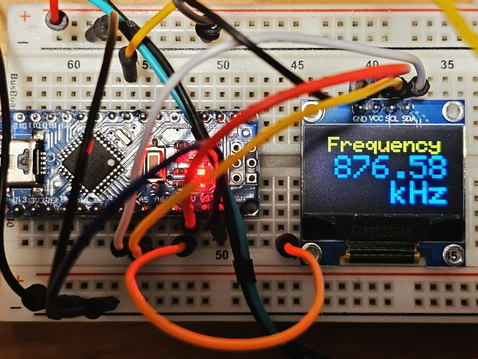

# Arduino Frequency Counter

Based on Frequency Counter Lib 

https://github.com/BlackBrix/Arduino-Frequency-Counter-Library

SSD1306 OLED Display

Automatic Gate Switching

The Frequency input is fixed to digital pin 5.

The pins for I2C are defined by the Wire-library.

On an arduino UNO and NANO: A4(SDA), A5(SCL)

## Photo

